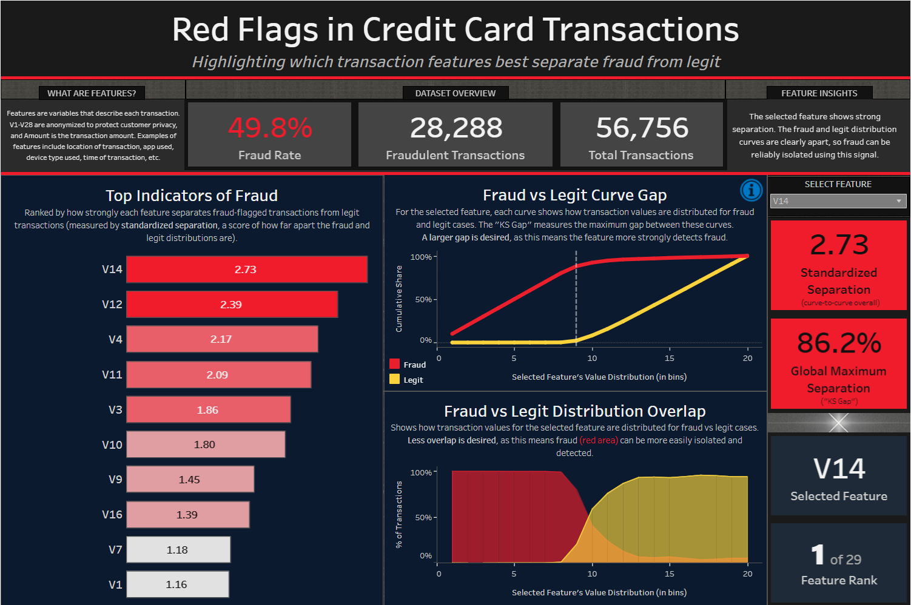

# Red Flags in Credit Card Transactions

---

## **Introduction**

This project demonstrates an end-to-end **fraud detection analysis pipeline** in Snowflake, focused on identifying patterns that distinguish fraudulent from legitimate credit card transactions.

---

## **About the Dataset**

The data comes from the **[Credit Card Fraud Detection Dataset (2023)](https://www.kaggle.com/datasets/nelgiriyewithana/credit-card-fraud-detection-dataset-2023)** published on Kaggle.

**Description**
This dataset contains **over 550,000 credit card transactions** made by European cardholders in 2023, and all personal details have been anonymized to maintain privacy. This data is widely used for developing and testing fraud detection models.

**Key Features**
- `id`: Transaction identifier
- `V1` - `V28`: Engineered numerical features derived using **Principal Component Analysis (PCA)**
  - PCA is a dimensionality-reduction technique that transforms sensitive raw attributes (such as time, location, cardholder details, etc.) into anonymized components, while still preserving useful numerical patterns for analysis.
- `Amount`: Value of the transaction
- `Class`: Binary flag that indicates the transaction's status (1 = fraudulent, 0 = legitimate)

> **Note:** The PCA components were pre-computed. They were not generated during this project.

---

## **Project Goals**

- **Build an enterprise-style data pipeline** in Snowflake with staging, analytics, and reporting layers
- **Partition the dataset into TRAIN, VALID, and TEST splits** to support both analysis and model evaluation
- **Identify the features with the strongest fraud signal**, focusing on the 28 PCA components and the transaction amount field

---

## **Table of Contents**

- [Introduction](#introduction)  
- [About the Dataset](#about-the-dataset)  
- [Project Goals](#project-goals)  
- [Tools Used](#tools-used)  
- [Project Files](#project-files)  
- [Project Pipeline / Workflow](#project-pipeline--workflow)  
  - [Staging Layer](#staging-layer)  
  - [Analytics Layer](#analytics-layer)  
  - [Reporting Layer](#reporting-layer)  
  - [Export Layer](#export-layer)  
- [Tableau](#tableau)  
  - [Standardized Separation (SS)](#standardized-separation-ss)  
  - [Dashboard](#dashboard)  
- [Conclusion](#conclusion)  
- [Tableau Dashboard Link](#tableau-dashboard-link)  

---

## **Tools Used**

- **Snowflake:** ELT pipeline and transformations
  - **Snowflake SQL:** Data preparation and feature analysis
  - **Snowpark Python:** Baseline ML model
- **Tableau:** Dashboard design and visualization

---

## **Project Files**

### **SQL Scripts**
- `01_create_database_and_schemas.sql`: Create database and schema layers 
- `02_0_file_format_and_stage.sql`: Define file formats and internal stage
- `02_5_upload_CSV.sql`: Load the Kaggle dataset into internal stage
- `03_create_staging_table.sql`: Build the staging table structure
- `04_copy_into_staging.sql`: Ingest raw transactions into staging table 
- `05_transform_to_fact_dim.sql`: Transform staging data into clean fact/dimension tables  
- `06_reporting_overview.sql`: Create initial reporting tables 
- `07_feature_separation_summary.sql`: Rank PCA features by separation strength (fraud vs legit) 
- `08_0_dashboard_feeds.sql`: Prepare base feeds for Tableau dashboard  
- `08_5_feature_profile.sql`: Build feature profile view for drill-downs  
- `09_dashboard_kpis_and_pairs.sql`: Define KPI metrics and fraud vs legit comparisons  
- `10_export_csvs.sql`: Export final reporting tables as Tableau-ready CSVs

### **Tableau-Ready CSV Exports**
- `RPT_DASHBOARD_HEADER.csv`: High-level KPI metrics
- `RPT_FEATURE_PROFILE_original.csv` / `RPT_FEATURE_PROFILE_final.csv`: Feature profile tables
- `RPT_FEATURE_DRILL_DOWN_BINS_original.csv` / `RPT_FEATURE_DRILL_DOWN_BINS_final.csv`: Feature binning tables 

### **Documentation**
- `README.md`: Project documentation  

---

## **Project Pipeline/Workflow**

The pipeline was implemented in Snowflake using a layered schema design (**STAGING → ANALYTICS → REPORTING**) aligned with an ELT workflow (**Extract → Load → Transform → Report → Export**).

### **STAGING Layer**

**Step 1: Create Database and Schemas**
- Created database `FRAUD_DETECTION`
- Defined schema layers: `STAGING`, `ANALYTICS`, and `REPORTING`

**Step 2: Define File Format and Internal Stage**
- Configured CSV file format
- Created internal stage `@TRANSACTIONS_STAGE` for CSV ingestion

**Step 2.5: Upload CSV into Stage**
- Original CSV exceeded Snowflake's upload size limit
  - Compressed to `.gz` using 7-Zip
- Uploaded compressed file into `@TRANSACTIONS_STAGE` via Snowsight

**Step 3: Create Staging Table**
- Created table `STAGING.TRANSACTIONS_RAW` mirroring the source schema (`id`, `V1-V28`, `Amount`, `Class`)

**Step 4: Load CSV into Staging Table**
- Validated parsing using `RETURN_10_ROWS` and `RETURN_ERRORS` options to ensure column alignment and datatype consistency
- Executed `COPY INTO` `STAGING.TRANSACTIONS_RAW` from `@TRANSACTIONS_STAGE`
- Confirmed row counts matched the source file (550K+ rows)

---

### **ANALYTICS Layer**

**Step 5: Transform to Fact/Dim Tables**
- Created view `ANALYTICS.TRANSACTIONS_BASE` from `STAGING.TRANSACTIONS_RAW`
  - Added `IS_FRAUD` Boolean flag (TRUE/FALSE), derived from `Class`
  - Preserved PCA features `V1-V28` and transaction `Amount`
- Created table `ANALYTICS.TRANSACTIONS_SPLIT` for deterministic 80/10/10 splitting (TRAIN / VALID / TEST)
  - Used `HASH(ID)` with modulo operation to assign each row to one of 10 integer buckets (0-9)
  - Ensures the same rows always fall into the same split (not random, and therefore, reproducible)
  - Verified row distribution and fraud balance across all three splits (TRAIN / VALID / TEST)
- Established foundation for both ML baseline training and downstream reporting

---

### **REPORTING Layer**

**Step 6: Reporting Overview**
- Created high-level summary views from `ANALYTICS.TRANSACTIONS_SPLIT` for quick inspection of class balance and fraud rates
  - `REPORTING.RPT_OVERALL_SUMMARY`: one-row overview of entire dataset (total transactions, fraudulent transactions, fraud rate)
  - `REPORTING.RPT_SPLIT_SUMMARY`: fraud rate by TRAIN / VALID / TEST splits
  - `REPORTING.RPT_FRAUD_RATE_BY_AMOUNT`: fraud rate by transaction `Amount` buckets within each split

> The fraud rate in this dataset is ~50% for all splits, which is not realistic. Real-world fraud rates are obviously much lower (often < 0.2%). This balanced dataset is specifically designed to support model training and evaluation.

**Step 7: Feature Separation Summary**
- Created view `RPT_FEATURE_AVERAGES` to compare fraud vs legit averages across features
  - Computed per-split (TRAIN, TEST) averages (`FRAUD_AVG` and `LEGIT_AVG`) for all features
  - Calculated:
    - **Difference in Means**: `DIFF` = `FRAUD_AVG` – `LEGIT_AVG`
    - **Separation**: `SEPARATION` = absolute value of `DIFF` (absolute difference in means)

> `SEPARATION` is the primary metric in this project because it provides a simple, interpretable signal of **how strongly each feature distinguishes fraud from legitimate transactions**.
> The word "separation" is used instead of "absolute difference in means" for clarity and storytelling purposes.
> The VALID split was excluded in this step so it can be reserved for model selection.

**Step 8: Dashboard Feeds (Parameter-Driven)**
- Created reporting views to power Tableau dashboard with parameterized slicing and charting
  - `RPT_FEATURE_DRILL_DOWN_STATS`:
    - Calculated mean, median, stddev, min, max for each feature's values (by fraud/legit class and split)
  - `RPT_FEATURE_DRILL_DOWN_BINS`:
    - Transactions were bucketed into **20 quantile-based bins** per feature
      - Each bin represents an equal-sized segment the feature's value distribution (e.g., 5% of all rows per bin), ensuring balanced coverage across the range
    - Calculated fraud vs legit proportions for each bin
    - Converted to **cumulative distribution functions (CDFs)** to show how the two classes diverge across the feature's value range
    - Computed the **Kolmogorov-Smirnov (KS) Gap** for each bin, which is the maximum difference between both CDFs, quantifying separation strength
      - **Local (bin-level):** difference between fraud and legit CDFs within each of the 20 bins
      - **Global:** maximum vertical gap between the two CDF curves, anywhere along the curves, regardless of bins

> A histogram for each feature was originally the plan, but **CDF curves + KS Gap** provide a sleeker, more interpretable comparison of fraud vs legit distributions.

**Step 8.5: Feature Profile View**
- Created view `RPT_FEATURE_PROFILE` as an extension of the earlier view `RPT_FEATURE_AVERAGES` (from Step 7)
  - Added metrics:
    - **Row counts:** fraud vs legit totals
    - **Medians and standard deviations** for both fraud and legit classes
    - **Feature ranking:** ranks features by **standardized separation** (this will be explained later in the Tableau section)

> This view includes all three splits (TRAIN / VALID / TEST). `RPT_FEATURE_AVERAGES` (from Step 7) excluded VALID.

**Step 9: Dashboard KPIs and Feature Visualization Feeds**
- Created view `RPT_DASHBOARD_HEADER` to provide high-level KPIs for the dashboard header
  - Metrics include:
    - Total rows, fraud rows, legit rows
    - Fraud rate, fraud-to-legit ratio
    - Mean and median transaction amounts (overall, fraud, legit)
    - Top 3 features per split ranked by `SEPARATION`
- Created view `RPT_SCATTER_FEATURE_PAIRS` for feature vs feature scatterplot comparisons (TEST split only)
  - Purpose was to visualize fraud vs legit `SEPARATION` in comparisons (e.g., V14 vs V10, V12 vs V4, etc.)
  - Pairs were chosen from top-ranked features with highest `SEPARATION` values

> Feature vs feature scatterplot comparisons were originally the plan, but this was later scrapped in favor of a **distribution overlap chart** for each feature, as this would provide better supporting context with all 29 features included

**Step 10: Export Reporting Views to CSV**
- Created stage `@EXPORT_STAGE` in `REPORTING` schema to hold Tableau-ready extracts
- Exported views as reproducible **single-file CSVs** with headers:
  - `RPT_DASHBOARD_HEADER`: global-level KPIs
  - `RPT_FEATURE_PROFILE`: feature-level statistics
  - `RPT_FEATURE_DRILL_DOWN_BINS`: distribution bins for fraud vs legit comparisons

---

## **Tableau**

### **Standardized Separation (SS)**

The raw separation values were not directly comparable across all 29 features.
- `AMOUNT` had a separation of **67.2**, but the highest among `V1-V28` was only **1.6**.

Therefore, these values were normalized by calculating **Standardized Separation (SS)**:

$$
SS = \frac{\text{DIFF}}{s_p}
$$

where:
- **DIFF** = difference in means between fraud and legit classes
- **s_p** = pooled standard deviation across both classes

$$
s_p = \sqrt{ \frac{(n_{\text{fraud}} - 1) s_{\text{fraud}}^2 + (n_{\text{legit}} - 1) s_{\text{legit}}^2}{n_{\text{fraud}} + n_{\text{legit}} - 2} }
$$

This adjustment ensures that all 29 features are comparable on a standardized scale.

### **Dashboard**

> This dashboard only includes the TEST split. TRAIN and VALID are not included.

**Header KPIs:** dataset-level metrics
- fraud rate
- Number of fraudulent transactions
- Total transactions

**Selected Feature KPIs:** feature-level metrics (choose one of 29 features from dropdown parameter)
- Standardized Separation (SS)
- Global Maximum Separation ("KS Gap")
- Ranking (according to SS)

**Top Indicators of Fraud**
- top 10 features by standardized separation
- highlights which features most strongly distinguish fraudulent from legit transactions

**Fraud vs Legit Curve Gap**
- shows the distributional divergence between fraud and legit cases for the selected feature

**Fraud vs Legit Distribution Overlap**
- displays how much (or how little) the two classes intersect (or overlap)
  - less overlap = higher potential for fraud
  - more overlap = lower potential for fraud

>  🎧 *Ambient music used while designing this dashboard:* [Windows 95 Retro Ambient (YouTube)](https://www.youtube.com/watch?v=tTJdddso9Y4)

--- 

## **Conclusion**

This project is centered upon a fraud detection analysis pipeline using cloud-based data warehousing (with Snowflake). By measuring and standardizing differences in means between the fraud and legit classes, this analysis not only identifies which features provide the strongest fraud signals, but it also *illustrates* these differences so that one can *literally see* how fraudulent activity diverges from legitimate activity, instead of simply looking at a static list of the top indicators.

Although TRAIN / VALID / TEST splits were created for modeling readiness, the dashboard includes only the TEST split to provide an unbiased view of feature behavior. Nonetheless, these reproducible splits lay the groundwork for future steps such as model training and evaluation.

---

## **Tableau Dashboard Link**

[🔗 View the Dashboard on Tableau Public](https://public.tableau.com/app/profile/dylan.barrett1539/viz/CreditCardTransactionFraudDetection/Dashboard)
